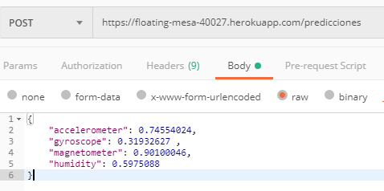
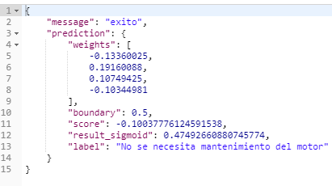

# Predicciones_server
Servidor para hacer predicciones

## Como se creo el modelo
[Link del modelo](https://github.com/mrHyde90/modelo_bosch)

El modelo se creo usando 4 variables:
1. accelerometer
2. gyroscope
3. magnetometer
4. humidity

**Nota:** Estas variables pueden ser cambiadas a la hora de hacer un nuevo modelo

Tambien hay que tener claro que el modelo se creo con una matriz de variables aleatorias de 300x4 (300filas y 4 columnas), que van de 0 a 1, es por ello que el modelo no es perfecto.

Otro punto a destacar es que como fue construido con variables aleatoria, los pesos y el intercept pueden variar cada vez que se corra el programa en python.

Los pesos que nosotros manejaremos son los que nos salia en la primera corrida:
[-0.13360025,  0.19160088,  0.10749425, -0.10344981]
1. accelerometer: -0.13360025,
2. gyroscope:  0.19160088
3. magnetometer: 0.10749425
4. humidity:  -0.10344981
5. intercept: -0.09699679

El modelo fue hecho usando sklearn, el algoritmo de regresion logistica, un algoritmo que sirve para clasificar de manera binaria usando la funcion sigmoide.

## Como funciona el servidor

para poder usar el servidor, se necesitan enviar los siguientes datos en formato json a la url: [URL del servidor](https://floating-mesa-40027.herokuapp.com/predicciones) usando el metodo **POST**

1. accelerometer
2. gyroscope
3. magnetometer
4. humidity

**NOta:** Estas variables pueden ser cambiadas luego

**Nota:** Recomiendo usar POSTMAN que puede ser encontrado en la siguiente liga: [POSTMAN](https://www.getpostman.com/) para poder hacer la peticion y checar como funciona la api.

**Ejemplo de la peticion POST**

### Que regresa el servidor?

Despues de hacer el query el servidor regresara 2 cosas: 
1. Un mensaje, que es una cadena diciendo exito
2. La prediccion, que es un objeto

La  prediccion se divide en 5 elementos:
1. weights: Los pesos que usamos para hacer la prediccion, son los mostrados arriba
2. boundary: Es el punto donde el label se vuelve 0 o 1, mientras mas alto el label mas probable es 0, el boundary solo puede estar en los rangos de 0 a 1
3. score: El resultado de la multiplicacion de los datos enviados al servidor y sus respectivos pesos para posteriormente hacer una suma con el intercept
4. result_sigmoid: el resultado del score luego de aplicar la sigmoide, este dato va de 0 a 1.
5. label: El resultado expresado en texto, si es menor a al boundary (0.5) es 0 o no se necesita mantenimiento

